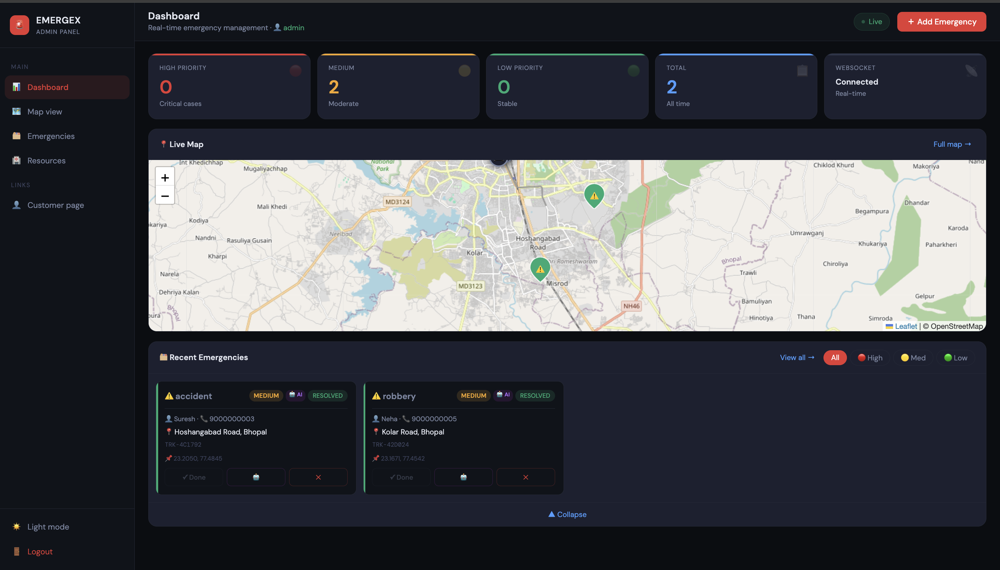
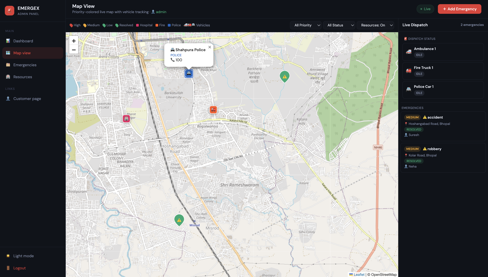
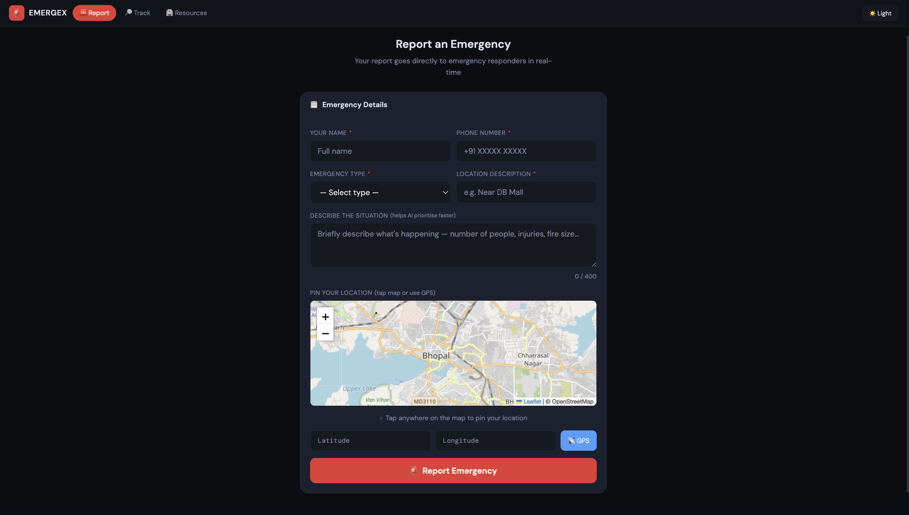
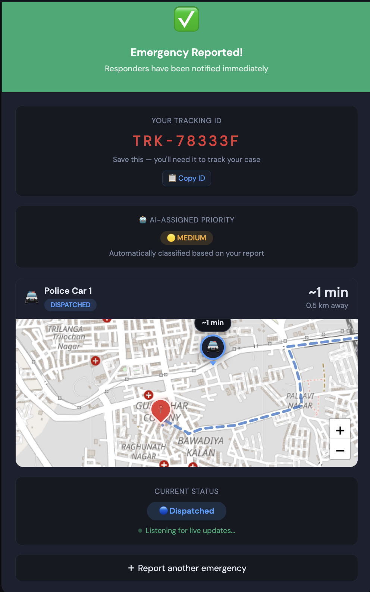

# 🚨 Emergex — Real-Time Emergency Management Dashboard

A full-stack emergency dispatch platform built with Spring Boot, WebSocket, and AI-powered priority classification. Inspired by real-world emergency response systems and delivery tracking apps like Swiggy and Zomato.

> **Live demo:** _coming soon after deployment_

---

## 📸 Screenshots

| Admin Dashboard | Live Map & Vehicle Tracking |
|---|---|
|  |  |

| Customer Report | Live Responder Tracking |
|---|---|
|  |  |

---

## ✨ Features

### 🎛 Admin Dashboard
- Real-time stats — HIGH / MEDIUM / LOW priority counts, total emergencies
- Live map with color-coded emergency markers and clustering (Leaflet + MarkerCluster)
- Vehicle dispatch panel — 🚑 Ambulance · 🚒 Fire Truck · 🚔 Police Car moving in real-time
- Filter by priority, status, and emergency type
- Search across all reports
- One-click resolve, delete, and manual AI reclassification per emergency
- Manual vehicle dispatch button
- Toast notification system for all actions
- HIGH priority alert card with pulse animation
- Add emergency modal with description field and map coordinate picker

### 🆘 Customer Portal
- Submit emergency reports with GPS or map pin
- AI auto-classifies priority (HIGH / MEDIUM / LOW) before saving
- Tracking ID generated instantly — shareable reference
- **Zomato-style live tracking map** — see your responder moving in real-time with ETA countdown and distance
- Animated dashed route line from dispatch point to emergency location
- Identity-verified tracking — name + phone verification before showing details
- Real-time status updates via WebSocket: `REPORTED → DISPATCHED → IN_PROGRESS → RESOLVED`
- Nearest hospitals, fire stations, and police stations map

### 🤖 AI Classification
- Powered by **Groq** (free, llama3-8b-8192)
- Classifies emergency type + description into HIGH / MEDIUM / LOW
- Falls back to MEDIUM if AI is unavailable — app never breaks
- Admin can re-trigger classification per emergency
- AI badge shown on classified emergencies

### 🚗 Vehicle Simulation
- 3 vehicles seeded on startup: Ambulance, Fire Truck, Police Car
- Assigned from nearest matching resource (hospital → ambulance, fire station → fire truck, police station → police car)
- Moves at realistic ~60 km/h toward emergency every 2 seconds via `@Scheduled`
- Status flow: `IDLE → DISPATCHED → IN_PROGRESS → RESOLVED → IDLE`
- Real road routes fetched from **OSRM** (free, OpenStreetMap-based)
- Route broadcast over WebSocket — no extra browser API calls

### 🔐 Security
- JWT authentication for admin routes
- Spring Security with stateless sessions
- Public endpoints for citizen reporting and tracking
- Admin seeded automatically on first run

---

## 🛠 Tech Stack

### Backend
| Technology | Purpose |
|---|---|
| Spring Boot 3 | REST API, WebSocket, Security |
| Spring Security + JWT | Authentication & authorization |
| Spring Data JPA | Database ORM |
| MySQL | Persistent storage |
| WebSocket + STOMP | Real-time push updates |
| `@Scheduled` | Vehicle movement simulation |
| Groq API (llama3) | AI emergency classification |
| OSRM Public API | Real road routing |
| Twilio (scaffolded) | SMS alerts (ready, not enabled) |

### Frontend
| Technology | Purpose |
|---|---|
| HTML / CSS / Vanilla JS | No build tool needed |
| Leaflet.js 1.9.4 | Interactive maps |
| Leaflet MarkerCluster | Emergency marker grouping |
| SockJS + STOMP.js | WebSocket client |
| DM Sans + DM Mono | Typography |

---

## 🗂 Project Structure

```
emergency-dashboard/
├── src/main/
│   ├── java/com/parth/emergency_dashboard/
│   │   ├── config/
│   │   │   └── SecurityConfig.java          # JWT + public route config
│   │   ├── controller/
│   │   │   ├── AuthController.java          # Login endpoint
│   │   │   ├── EmergencyController.java     # Emergency CRUD + verify
│   │   │   └── VehicleController.java       # Vehicle state endpoint
│   │   ├── model/
│   │   │   ├── Emergency.java               # Emergency entity
│   │   │   ├── User.java                    # Admin user entity
│   │   │   └── Vehicle.java                 # Vehicle entity with route
│   │   ├── repository/
│   │   │   ├── EmergencyRepository.java
│   │   │   ├── UserRepository.java
│   │   │   └── VehicleRepository.java
│   │   ├── security/
│   │   │   ├── JwtFilter.java
│   │   │   └── JwtUtil.java
│   │   └── service/
│   │       ├── AiClassificationService.java # Groq API integration
│   │       ├── EmergencyService.java        # Core business logic
│   │       ├── SmsService.java              # Twilio scaffold
│   │       └── VehicleSimulationService.java# Movement + OSRM routing
│   └── resources/
│       ├── static/
│       │   ├── index.html                   # Admin dashboard
│       │   ├── customer.html                # Citizen portal
│       │   └── login.html                   # Auth page
│       └── application.properties
└── pom.xml
```

---

## 🚀 Getting Started

### Prerequisites
- Java 17+
- Maven 3.8+
- MySQL 8+
- A free [Groq API key](https://console.groq.com)

### 1. Clone the repo
```bash
git clone https://github.com/Parth152-create/emergency-dashboard.git
cd emergency-dashboard
```

### 2. Create the database
```sql
CREATE DATABASE emergency_db;
```

### 3. Configure `application.properties`
```properties
spring.datasource.url=jdbc:mysql://localhost:3306/emergency_db
spring.datasource.username=root
spring.datasource.password=your_password

jwt.secret=your-secret-key-min-32-chars-change-before-deploy
jwt.expiration.ms=86400000

groq.api.key=your_groq_api_key_here

twilio.enabled=false
```

### 4. Run
```bash
./mvnw spring-boot:run
```

### 5. Open
| URL | Description |
|---|---|
| `http://localhost:8081/login.html` | Admin login |
| `http://localhost:8081/customer.html` | Citizen portal |

**Default admin credentials:** `admin` / `admin123`
> ⚠️ Change these before deploying to production

---

## 🔌 API Endpoints

### Public (no auth required)
| Method | Endpoint | Description |
|---|---|---|
| `POST` | `/api/auth/login` | Admin login → returns JWT |
| `POST` | `/api/emergencies` | Submit emergency report |
| `GET` | `/api/emergencies/track/{trackingId}` | Track by ID |
| `POST` | `/api/emergencies/verify` | Verify identity + get details |

### Admin (JWT required)
| Method | Endpoint | Description |
|---|---|---|
| `GET` | `/api/emergencies` | Get all emergencies |
| `PUT` | `/api/emergencies/{id}` | Update emergency |
| `DELETE` | `/api/emergencies/{id}` | Delete emergency |
| `POST` | `/api/emergencies/{id}/reclassify` | Re-run AI classification |
| `PATCH` | `/api/emergencies/{id}/priority` | Manual priority override |
| `GET` | `/api/vehicles` | Get all vehicle states |

### WebSocket Topics (STOMP)
| Topic | Description |
|---|---|
| `/topic/emergencies` | New / updated emergencies |
| `/topic/vehicles` | Vehicle position updates (every 2s) |
| `/topic/track/{trackingId}` | Status updates for a specific emergency |

---

## 🔄 Emergency Status Flow

```
REPORTED → DISPATCHED → IN_PROGRESS → RESOLVED
    ↑           ↑              ↑            ↑
  Citizen    Vehicle        Vehicle      Vehicle
  submits   assigned       ~500m away   arrives
```

---

## 🧠 AI Classification

When a citizen submits a report, the description and emergency type are sent to Groq's llama3-8b model:

```
HIGH  → Immediate threat to life (fire, serious injury, violence)
MEDIUM → Urgent but not immediately life-threatening
LOW   → Minor incidents, precautionary reports
```

The AI response is deterministic (`temperature: 0.0`) and always returns exactly one word. If the API is unavailable, priority defaults to `MEDIUM` — the app never crashes.

---

## 🗺 Vehicle Tracking

Each vehicle dispatches from the nearest matching resource:
- **FIRE** → nearest fire station
- **MEDICAL / ACCIDENT / FLOOD** → nearest hospital
- **POLICE** → nearest police station

The route is fetched once from the OSRM public API (real OpenStreetMap road data) and stored on the vehicle entity. It's broadcast over WebSocket with every position update — no browser API calls needed.

Speed is simulated at ~60 km/h (~2 minute travel time across Bhopal).

---

## 📦 Environment Variables (Production)

```bash
GROQ_API_KEY=your_key
SPRING_DATASOURCE_PASSWORD=your_db_password
JWT_SECRET=your_64_char_random_secret
TWILIO_ACCOUNT_SID=optional
TWILIO_AUTH_TOKEN=optional
TWILIO_PHONE_NUMBER=optional
```

---

## 🚧 Roadmap

- [ ] Railway + Netlify deployment
- [ ] Twilio SMS for HIGH priority alerts
- [ ] Multi-admin support with roles
- [ ] Historical analytics view
- [ ] Mobile app (Flutter)

---

## 👨‍💻 Author

**Parth** — [GitHub](https://github.com/Parth152-create)

---

## 📄 License

MIT — free to use, modify, and distribute.
